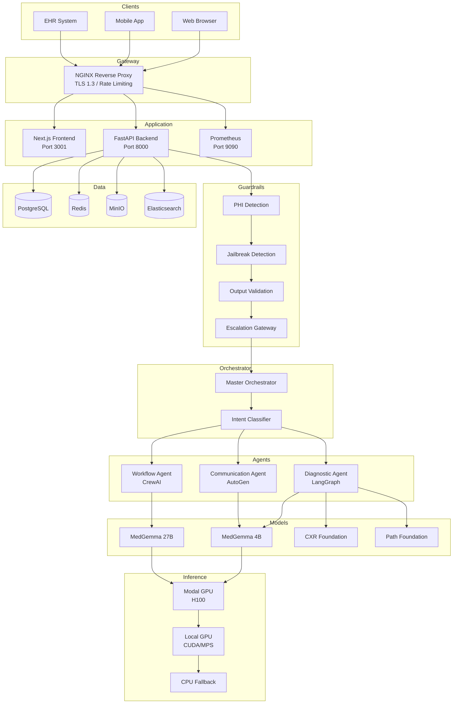
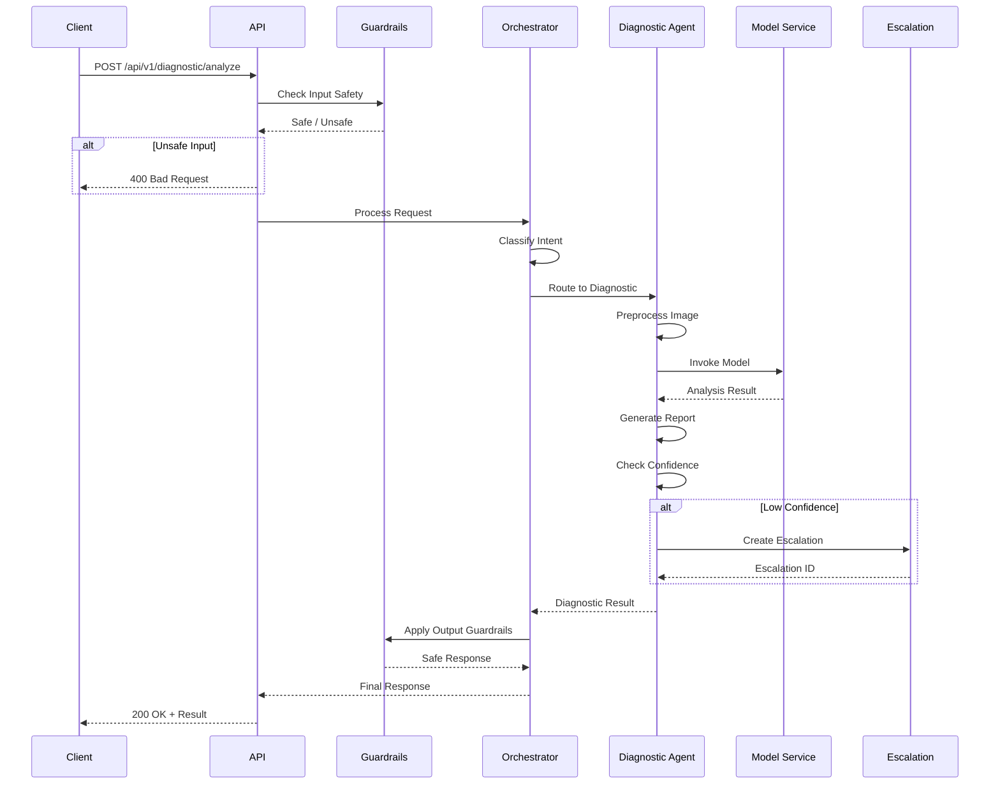
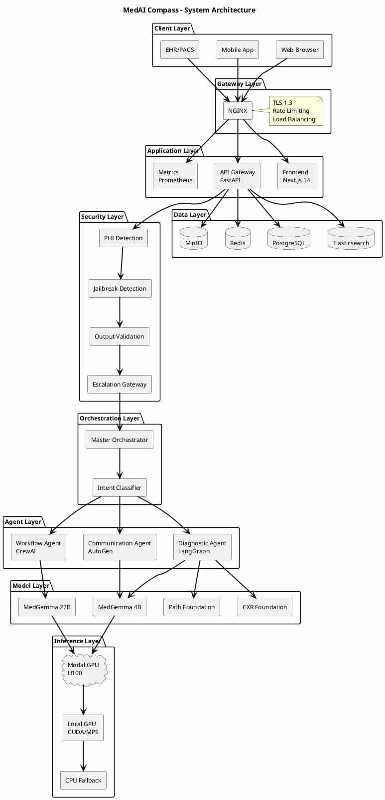

# MedAI Compass - System Architecture Diagrams

## 1. High-Level System Architecture

### ASCII Diagram

```
┌─────────────────────────────────────────────────────────────────────────────────────────┐
│                                    MEDAI COMPASS                                         │
│                        Production-Grade Medical AI Platform                              │
└─────────────────────────────────────────────────────────────────────────────────────────┘

                                         ┌─────────────┐
                                         │   CLIENTS   │
                                         └──────┬──────┘
                                                │
                    ┌───────────────────────────┼───────────────────────────┐
                    │                           │                           │
                    ▼                           ▼                           ▼
            ┌───────────────┐           ┌───────────────┐           ┌───────────────┐
            │  Web Browser  │           │  Mobile App   │           │   EHR/PACS    │
            │  (Next.js)    │           │   (Future)    │           │  Integration  │
            └───────┬───────┘           └───────┬───────┘           └───────┬───────┘
                    │                           │                           │
                    └───────────────────────────┼───────────────────────────┘
                                                │
                                                ▼
┌─────────────────────────────────────────────────────────────────────────────────────────┐
│                                     NGINX REVERSE PROXY                                  │
│                              (TLS 1.3, Rate Limiting, Load Balancing)                   │
└─────────────────────────────────────────────────────────────────────────────────────────┘
                                                │
                    ┌───────────────────────────┼───────────────────────────┐
                    │                           │                           │
                    ▼                           ▼                           ▼
┌───────────────────────────┐   ┌───────────────────────────┐   ┌───────────────────────┐
│      FRONTEND (3001)      │   │      API GATEWAY (8000)   │   │    METRICS (9090)     │
│  ┌─────────────────────┐  │   │  ┌─────────────────────┐  │   │  ┌─────────────────┐  │
│  │     Next.js 14      │  │   │  │      FastAPI        │  │   │  │   Prometheus    │  │
│  │   React + Shadcn    │  │   │  │   Uvicorn Workers   │  │   │  │   Grafana       │  │
│  │   Tailwind CSS      │  │   │  │   Async/Await       │  │   │  │   Alertmanager  │  │
│  └─────────────────────┘  │   │  └─────────────────────┘  │   │  └─────────────────┘  │
└───────────────────────────┘   └─────────────┬─────────────┘   └───────────────────────┘
                                              │
                                              ▼
┌─────────────────────────────────────────────────────────────────────────────────────────┐
│                                   GUARDRAILS LAYER                                       │
│  ┌──────────────┐  ┌──────────────┐  ┌──────────────┐  ┌──────────────┐  ┌───────────┐  │
│  │ PHI Detection│  │  Jailbreak   │  │   Output     │  │  Uncertainty │  │ Escalation│  │
│  │   & Masking  │  │  Detection   │  │  Validation  │  │   Scoring    │  │  Gateway  │  │
│  └──────────────┘  └──────────────┘  └──────────────┘  └──────────────┘  └───────────┘  │
└─────────────────────────────────────────────────────────────────────────────────────────┘
                                              │
                                              ▼
┌─────────────────────────────────────────────────────────────────────────────────────────┐
│                               MASTER ORCHESTRATOR                                        │
│                                                                                          │
│  ┌────────────────────────────────────────────────────────────────────────────────────┐ │
│  │                          INTENT CLASSIFICATION                                      │ │
│  │    ┌─────────────┐    ┌─────────────┐    ┌─────────────┐    ┌─────────────┐        │ │
│  │    │  Diagnostic │    │  Workflow   │    │Communication│    │   Unknown   │        │ │
│  │    │   Keywords  │    │  Keywords   │    │  Keywords   │    │  (Default)  │        │ │
│  │    └─────────────┘    └─────────────┘    └─────────────┘    └─────────────┘        │ │
│  └────────────────────────────────────────────────────────────────────────────────────┘ │
│                                              │                                           │
│                    ┌─────────────────────────┼─────────────────────────┐                │
│                    ▼                         ▼                         ▼                │
│  ┌──────────────────────┐  ┌──────────────────────┐  ┌──────────────────────┐          │
│  │   DIAGNOSTIC AGENT   │  │   WORKFLOW AGENT     │  │  COMMUNICATION AGENT │          │
│  │      (LangGraph)     │  │      (CrewAI)        │  │      (AutoGen)       │          │
│  └──────────────────────┘  └──────────────────────┘  └──────────────────────┘          │
└─────────────────────────────────────────────────────────────────────────────────────────┘
                                              │
                                              ▼
┌─────────────────────────────────────────────────────────────────────────────────────────┐
│                                  MODEL INFERENCE LAYER                                   │
│                                                                                          │
│  ┌─────────────────────────────────────────────────────────────────────────────────┐    │
│  │                              INFERENCE SERVICE                                   │    │
│  │   ┌─────────────┐  ┌─────────────┐  ┌─────────────┐  ┌─────────────┐            │    │
│  │   │  Trained    │  │ Modal GPU   │  │ Local GPU   │  │    CPU      │            │    │
│  │   │  Checkpoint │─▶│   (H100)    │─▶│ (CUDA/MPS)  │─▶│  Fallback   │            │    │
│  │   └─────────────┘  └─────────────┘  └─────────────┘  └─────────────┘            │    │
│  └─────────────────────────────────────────────────────────────────────────────────┘    │
│                                              │                                           │
│  ┌──────────────────┐  ┌──────────────────┐  ┌──────────────────┐  ┌────────────────┐   │
│  │   MedGemma 4B    │  │  MedGemma 27B    │  │  CXR Foundation  │  │ Path Foundation│   │
│  │   (Text Gen)     │  │  (Documentation) │  │  (Chest X-Ray)   │  │  (Pathology)   │   │
│  └──────────────────┘  └──────────────────┘  └──────────────────┘  └────────────────┘   │
└─────────────────────────────────────────────────────────────────────────────────────────┘
                                              │
                                              ▼
┌─────────────────────────────────────────────────────────────────────────────────────────┐
│                                    DATA LAYER                                            │
│                                                                                          │
│  ┌──────────────────┐  ┌──────────────────┐  ┌──────────────────┐  ┌────────────────┐   │
│  │   PostgreSQL     │  │      Redis       │  │      MinIO       │  │   Elasticsearch│   │
│  │   (5432)         │  │     (6379)       │  │     (9001)       │  │    (9200)      │   │
│  │                  │  │                  │  │                  │  │                │   │
│  │ • Patient Data   │  │ • Sessions       │  │ • DICOM Images   │  │ • Audit Logs   │   │
│  │ • Escalations    │  │ • Cache          │  │ • Model Weights  │  │ • Search Index │   │
│  │ • Audit Logs     │  │ • Rate Limits    │  │ • Checkpoints    │  │ • Analytics    │   │
│  │ • Checkpoints    │  │ • Pub/Sub        │  │ • Temp Files     │  │                │   │
│  └──────────────────┘  └──────────────────┘  └──────────────────┘  └────────────────┘   │
└─────────────────────────────────────────────────────────────────────────────────────────┘
```

### Image Placeholder Description

**[IMAGE: High-Level System Architecture]**

**Dimensions**: 1920x1080px (16:9 landscape)
**Style**: Clean, modern, medical-themed with blue/teal color palette

**Visual Elements**:
1. **Header Banner**: Dark blue gradient with "MedAI Compass" logo and tagline
2. **Client Layer** (Top): Three device icons (browser, mobile, EHR system) with user silhouettes
3. **Gateway Layer**: Shield icon representing Nginx with lock symbol for TLS
4. **Application Layer**: Three boxes in a row (Frontend, API, Metrics) with distinct icons
5. **Guardrails Layer**: Five shield-shaped components with safety icons (eye, lock, checkmark)
6. **Orchestrator Layer**: Central brain icon with three arrows pointing to agent boxes
7. **Agent Layer**: Three distinct colored boxes (Blue=Diagnostic, Green=Workflow, Orange=Communication)
8. **Model Layer**: GPU chip icon with four model logos arranged horizontally
9. **Data Layer**: Four database cylinder icons with distinct colors and labels
10. **Connecting Lines**: Animated flow arrows showing data movement
11. **Security Badges**: HIPAA, SOC2, encryption badges in corner

---

## 2. Multi-Agent System Architecture

### ASCII Diagram

```
┌─────────────────────────────────────────────────────────────────────────────────────┐
│                            MULTI-AGENT ORCHESTRATION                                 │
└─────────────────────────────────────────────────────────────────────────────────────┘

                                    ┌─────────────────┐
                                    │  User Request   │
                                    │                 │
                                    │ "Analyze this   │
                                    │  chest X-ray"   │
                                    └────────┬────────┘
                                             │
                                             ▼
┌─────────────────────────────────────────────────────────────────────────────────────┐
│                              INPUT GUARDRAILS                                        │
│                                                                                      │
│    ┌────────────────┐     ┌────────────────┐     ┌────────────────┐                 │
│    │ PHI Detection  │────▶│   Jailbreak    │────▶│  Scope Check   │                 │
│    │                │     │   Detection    │     │                │                 │
│    │ SSN, MRN, DOB  │     │ 8 Categories   │     │ Medical Only   │                 │
│    │ Phone, Email   │     │ Role-play,etc  │     │                │                 │
│    └────────────────┘     └────────────────┘     └────────────────┘                 │
│              │                     │                     │                           │
│              └─────────────────────┴─────────────────────┘                           │
│                                    │                                                 │
│                         ┌──────────▼──────────┐                                      │
│                         │   SAFE TO PROCEED?  │                                      │
│                         └──────────┬──────────┘                                      │
│                                    │                                                 │
│                    ┌───────────────┴───────────────┐                                 │
│                    │ YES                       NO  │                                 │
│                    ▼                               ▼                                 │
│              [Continue]                    [Reject Request]                          │
└─────────────────────────────────────────────────────────────────────────────────────┘
                                             │
                                             ▼
┌─────────────────────────────────────────────────────────────────────────────────────┐
│                           MASTER ORCHESTRATOR                                        │
│                                                                                      │
│    ┌──────────────────────────────────────────────────────────────────────────┐     │
│    │                      INTENT CLASSIFIER                                    │     │
│    │                                                                           │     │
│    │   Input: "Analyze this chest X-ray"                                       │     │
│    │                                                                           │     │
│    │   ┌─────────────────┐  ┌─────────────────┐  ┌─────────────────┐          │     │
│    │   │ DIAGNOSTIC: 0.8 │  │ WORKFLOW: 0.1   │  │ COMMUNICATION:  │          │     │
│    │   │ ✓ "x-ray"       │  │                 │  │     0.1         │          │     │
│    │   │ ✓ "analyze"     │  │                 │  │                 │          │     │
│    │   │ + multimodal    │  │                 │  │                 │          │     │
│    │   └─────────────────┘  └─────────────────┘  └─────────────────┘          │     │
│    │                                                                           │     │
│    │   Result: DIAGNOSTIC (confidence: 0.85)                                   │     │
│    └──────────────────────────────────────────────────────────────────────────┘     │
│                                             │                                        │
│                                             ▼                                        │
│    ┌──────────────────────────────────────────────────────────────────────────┐     │
│    │                        DOMAIN ROUTER                                      │     │
│    │                                                                           │     │
│    │        ┌─────────┐         ┌─────────┐         ┌─────────┐               │     │
│    │        │DIAGNOSTIC│         │WORKFLOW │         │  COMM   │               │     │
│    │        │  ████   │         │         │         │         │               │     │
│    │        │  ████   │         │         │         │         │               │     │
│    │        └────┬────┘         └─────────┘         └─────────┘               │     │
│    │             │                                                             │     │
│    └─────────────┼─────────────────────────────────────────────────────────────┘     │
└──────────────────┼──────────────────────────────────────────────────────────────────┘
                   │
                   ▼
┌─────────────────────────────────────────────────────────────────────────────────────┐
│                        DIAGNOSTIC AGENT (LangGraph)                                  │
│                                                                                      │
│    ┌──────────┐    ┌──────────┐    ┌──────────┐    ┌──────────┐    ┌──────────┐    │
│    │PREPROCESS│───▶│ ANALYZE  │───▶│ LOCALIZE │───▶│ GENERATE │───▶│CONFIDENCE│    │
│    │  IMAGE   │    │          │    │ FINDINGS │    │  REPORT  │    │  CHECK   │    │
│    └──────────┘    └──────────┘    └──────────┘    └──────────┘    └────┬─────┘    │
│                                                                          │          │
│                                                              ┌───────────┴────────┐ │
│                                                              │                    │ │
│                                                    ┌─────────▼───┐    ┌───────────▼┐│
│                                                    │ HIGH (≥0.9) │    │ LOW (<0.9) ││
│                                                    └──────┬──────┘    └──────┬─────┘│
│                                                           │                  │      │
│                                                           ▼                  ▼      │
│                                                    ┌──────────┐       ┌──────────┐  │
│                                                    │ FINALIZE │       │  HUMAN   │  │
│                                                    │          │       │  REVIEW  │  │
│                                                    └──────────┘       └────┬─────┘  │
│                                                                            │        │
│                                                                            ▼        │
│                                                                     ┌──────────┐    │
│                                                                     │ FINALIZE │    │
│                                                                     └──────────┘    │
└─────────────────────────────────────────────────────────────────────────────────────┘
                                             │
                                             ▼
┌─────────────────────────────────────────────────────────────────────────────────────┐
│                              OUTPUT GUARDRAILS                                       │
│                                                                                      │
│    ┌────────────────┐     ┌────────────────┐     ┌────────────────┐                 │
│    │  Disclaimer    │────▶│  Hallucination │────▶│   Confidence   │                 │
│    │  Injection     │     │   Detection    │     │    Warning     │                 │
│    └────────────────┘     └────────────────┘     └────────────────┘                 │
│                                                                                      │
└─────────────────────────────────────────────────────────────────────────────────────┘
                                             │
                                             ▼
┌─────────────────────────────────────────────────────────────────────────────────────┐
│                             ESCALATION GATEWAY                                       │
│                                                                                      │
│    ┌─────────────────────────────────────────────────────────────────────────┐      │
│    │                     ESCALATION DECISION TREE                             │      │
│    │                                                                          │      │
│    │    Critical Finding?  ──YES──▶  [CREATE URGENT ESCALATION]              │      │
│    │           │                                                              │      │
│    │          NO                                                              │      │
│    │           │                                                              │      │
│    │           ▼                                                              │      │
│    │    Safety Concern?  ──YES──▶  [CREATE HIGH-PRIORITY ESCALATION]         │      │
│    │           │                                                              │      │
│    │          NO                                                              │      │
│    │           │                                                              │      │
│    │           ▼                                                              │      │
│    │    Low Confidence?  ──YES──▶  [CREATE REVIEW ESCALATION]                │      │
│    │           │                                                              │      │
│    │          NO                                                              │      │
│    │           │                                                              │      │
│    │           ▼                                                              │      │
│    │    [RETURN RESPONSE TO USER]                                             │      │
│    └─────────────────────────────────────────────────────────────────────────┘      │
└─────────────────────────────────────────────────────────────────────────────────────┘
```

---

## 3. LangGraph Diagnostic Workflow

### ASCII Diagram

```
┌─────────────────────────────────────────────────────────────────────────────────────┐
│                      LANGGRAPH DIAGNOSTIC WORKFLOW                                   │
│                         Stateful Medical Image Analysis                              │
└─────────────────────────────────────────────────────────────────────────────────────┘

                              ┌────────────────────┐
                              │   DiagnosticState  │
                              │                    │
                              │ • patient_id       │
                              │ • session_id       │
                              │ • images[]         │
                              │ • findings[]       │
                              │ • confidence       │
                              │ • requires_review  │
                              │ • report           │
                              └─────────┬──────────┘
                                        │
                                        ▼
    ┌───────────────────────────────────────────────────────────────────────────────┐
    │                                                                               │
    │  ┌─────────────────┐                                                          │
    │  │   ENTRY POINT   │                                                          │
    │  │                 │                                                          │
    │  │  preprocess_    │                                                          │
    │  │    images       │                                                          │
    │  └────────┬────────┘                                                          │
    │           │                                                                   │
    │           │  • Load DICOM files                                               │
    │           │  • Apply windowing (lung/mediastinum/bone)                        │
    │           │  • Normalize pixel values                                         │
    │           │  • Extract metadata                                               │
    │           │                                                                   │
    │           ▼                                                                   │
    │  ┌─────────────────┐                                                          │
    │  │ route_by_       │                                                          │
    │  │   modality      │                                                          │
    │  └────────┬────────┘                                                          │
    │           │                                                                   │
    │           ├──────────────────────────┬──────────────────────────┐             │
    │           │                          │                          │             │
    │           ▼                          ▼                          ▼             │
    │  ┌─────────────────┐      ┌─────────────────┐      ┌─────────────────┐        │
    │  │  analyze_with_  │      │  analyze_with_  │      │  analyze_with_  │        │
    │  │  medgemma       │      │  cxr_foundation │      │ path_foundation │        │
    │  │                 │      │                 │      │                 │        │
    │  │  General Text   │      │  Chest X-Ray    │      │  Pathology/     │        │
    │  │  Analysis       │      │  Specialist     │      │  Histology      │        │
    │  └────────┬────────┘      └────────┬────────┘      └────────┬────────┘        │
    │           │                        │                        │                 │
    │           └────────────────────────┴────────────────────────┘                 │
    │                                    │                                          │
    │                                    ▼                                          │
    │                         ┌─────────────────┐                                   │
    │                         │   localize_     │                                   │
    │                         │    findings     │                                   │
    │                         │                 │                                   │
    │                         │ • Bounding boxes│                                   │
    │                         │ • Coordinates   │                                   │
    │                         │ • Severity      │                                   │
    │                         └────────┬────────┘                                   │
    │                                  │                                            │
    │                                  ▼                                            │
    │                         ┌─────────────────┐                                   │
    │                         │   generate_     │                                   │
    │                         │    report       │                                   │
    │                         │                 │                                   │
    │                         │ • FHIR format   │                                   │
    │                         │ • Structured    │                                   │
    │                         │ • Narrative     │                                   │
    │                         └────────┬────────┘                                   │
    │                                  │                                            │
    │                                  ▼                                            │
    │                         ┌─────────────────┐                                   │
    │                         │  confidence_    │                                   │
    │                         │    check        │                                   │
    │                         └────────┬────────┘                                   │
    │                                  │                                            │
    │              ┌───────────────────┴───────────────────┐                        │
    │              │                                       │                        │
    │              ▼                                       ▼                        │
    │    ┌──────────────────┐                   ┌──────────────────┐                │
    │    │ confidence ≥ 0.9 │                   │ confidence < 0.9 │                │
    │    │                  │                   │                  │                │
    │    │   HIGH CONF      │                   │   LOW CONF       │                │
    │    └────────┬─────────┘                   └────────┬─────────┘                │
    │             │                                      │                          │
    │             │                                      ▼                          │
    │             │                            ┌──────────────────┐                 │
    │             │                            │   human_review   │                 │
    │             │                            │                  │                 │
    │             │                            │ • Flag for review│                 │
    │             │                            │ • Notify clinician│                │
    │             │                            │ • Queue in system│                 │
    │             │                            └────────┬─────────┘                 │
    │             │                                     │                           │
    │             └─────────────────┬───────────────────┘                           │
    │                               │                                               │
    │                               ▼                                               │
    │                      ┌──────────────────┐                                     │
    │                      │     finalize     │                                     │
    │                      │                  │                                     │
    │                      │ • Final report   │                                     │
    │                      │ • Audit log      │                                     │
    │                      │ • Return state   │                                     │
    │                      └────────┬─────────┘                                     │
    │                               │                                               │
    │                               ▼                                               │
    │                            [ END ]                                            │
    │                                                                               │
    └───────────────────────────────────────────────────────────────────────────────┘

    ┌───────────────────────────────────────────────────────────────────────────────┐
    │                         CHECKPOINT PERSISTENCE                                 │
    │                                                                               │
    │    ┌─────────────┐          ┌─────────────┐          ┌─────────────┐          │
    │    │  In-Memory  │◀────────▶│ PostgreSQL  │◀────────▶│   Resume    │          │
    │    │  (Default)  │          │   Saver     │          │   Support   │          │
    │    └─────────────┘          └─────────────┘          └─────────────┘          │
    │                                                                               │
    │    State is checkpointed after each node for:                                 │
    │    • Multi-instance deployment                                                │
    │    • Failure recovery                                                         │
    │    • Human review pause/resume                                                │
    └───────────────────────────────────────────────────────────────────────────────┘
```

---

## 4. CrewAI Workflow Architecture

### ASCII Diagram

```
┌─────────────────────────────────────────────────────────────────────────────────────┐
│                          CREWAI WORKFLOW ARCHITECTURE                                │
│                         Clinical Operations Automation                               │
└─────────────────────────────────────────────────────────────────────────────────────┘

                              ┌────────────────────┐
                              │  Workflow Request  │
                              │                    │
                              │ • Documentation    │
                              │ • Scheduling       │
                              │ • Prior Auth       │
                              └─────────┬──────────┘
                                        │
                                        ▼
    ┌───────────────────────────────────────────────────────────────────────────────┐
    │                              WORKFLOW CREW                                     │
    │                                                                               │
    │    ┌─────────────────────────────────────────────────────────────────────┐    │
    │    │                         AGENT POOL                                   │    │
    │    │                                                                      │    │
    │    │  ┌──────────────────┐  ┌──────────────────┐  ┌──────────────────┐   │    │
    │    │  │  SCHEDULER       │  │  DOCUMENTER      │  │  PRIOR AUTH      │   │    │
    │    │  │  AGENT           │  │  AGENT           │  │  AGENT           │   │    │
    │    │  │                  │  │                  │  │                  │   │    │
    │    │  │ Role:            │  │ Role:            │  │ Role:            │   │    │
    │    │  │ "Clinical        │  │ "Medical         │  │ "Insurance       │   │    │
    │    │  │  Scheduler"      │  │  Documenter"     │  │  Specialist"     │   │    │
    │    │  │                  │  │                  │  │                  │   │    │
    │    │  │ Goal:            │  │ Goal:            │  │ Goal:            │   │    │
    │    │  │ Optimize patient │  │ Generate accurate│  │ Maximize auth    │   │    │
    │    │  │ scheduling       │  │ clinical docs    │  │ approval rate    │   │    │
    │    │  │                  │  │                  │  │                  │   │    │
    │    │  │ Backstory:       │  │ Backstory:       │  │ Backstory:       │   │    │
    │    │  │ 15 years exp     │  │ Medical scribe   │  │ Claims processor │   │    │
    │    │  │ in healthcare    │  │ with AI assist   │  │ turned AI        │   │    │
    │    │  │ scheduling       │  │ capabilities     │  │                  │   │    │
    │    │  └──────────────────┘  └──────────────────┘  └──────────────────┘   │    │
    │    └─────────────────────────────────────────────────────────────────────┘    │
    │                                                                               │
    │    ┌─────────────────────────────────────────────────────────────────────┐    │
    │    │                         TASK ROUTER                                  │    │
    │    │                                                                      │    │
    │    │    Request Type ─────────────┬──────────────┬──────────────┐        │    │
    │    │                              │              │              │        │    │
    │    │                              ▼              ▼              ▼        │    │
    │    │                     ┌────────────┐  ┌────────────┐  ┌────────────┐  │    │
    │    │                     │ Scheduling │  │Documentation│  │ Prior Auth │  │    │
    │    │                     │   Task     │  │   Task     │  │   Task     │  │    │
    │    │                     └─────┬──────┘  └─────┬──────┘  └─────┬──────┘  │    │
    │    │                           │               │               │         │    │
    │    │                           ▼               ▼               ▼         │    │
    │    │                     ┌────────────┐  ┌────────────┐  ┌────────────┐  │    │
    │    │                     │ Scheduler  │  │ Documenter │  │ Prior Auth │  │    │
    │    │                     │   Agent    │  │   Agent    │  │   Agent    │  │    │
    │    │                     └────────────┘  └────────────┘  └────────────┘  │    │
    │    └─────────────────────────────────────────────────────────────────────┘    │
    │                                                                               │
    └───────────────────────────────────────────────────────────────────────────────┘

    ┌───────────────────────────────────────────────────────────────────────────────┐
    │                      DOCUMENTATION WORKFLOW DETAIL                             │
    │                                                                               │
    │    ┌────────────────┐                                                         │
    │    │ Documentation  │                                                         │
    │    │ Request        │                                                         │
    │    │                │                                                         │
    │    │ • patient_id   │                                                         │
    │    │ • doc_type     │                                                         │
    │    │ • encounter_id │                                                         │
    │    │ • clinical_    │                                                         │
    │    │   notes[]      │                                                         │
    │    │ • diagnoses[]  │                                                         │
    │    └───────┬────────┘                                                         │
    │            │                                                                  │
    │            ▼                                                                  │
    │    ┌────────────────┐    ┌────────────────┐    ┌────────────────┐            │
    │    │ GATHER CONTEXT │───▶│ GENERATE DRAFT │───▶│ VALIDATE DOC   │            │
    │    │                │    │                │    │                │            │
    │    │ • Patient hx   │    │ • MedGemma 27B │    │ • Completeness │            │
    │    │ • Prior visits │    │ • Templates    │    │ • Accuracy     │            │
    │    │ • Current meds │    │ • FHIR format  │    │ • Compliance   │            │
    │    └────────────────┘    └────────────────┘    └───────┬────────┘            │
    │                                                        │                      │
    │                                                        ▼                      │
    │                                               ┌────────────────┐              │
    │                                               │ RETURN RESULT  │              │
    │                                               │                │              │
    │                                               │ • content      │              │
    │                                               │ • success      │              │
    │                                               │ • metadata     │              │
    │                                               └────────────────┘              │
    └───────────────────────────────────────────────────────────────────────────────┘
```

---

## 5. Data Flow Architecture

### ASCII Diagram

```
┌─────────────────────────────────────────────────────────────────────────────────────┐
│                              DATA FLOW ARCHITECTURE                                  │
└─────────────────────────────────────────────────────────────────────────────────────┘

┌──────────────────────────────────────────────────────────────────────────────────────┐
│                                   REQUEST FLOW                                        │
│                                                                                       │
│   CLIENT                API                  ORCHESTRATOR              AGENT          │
│     │                    │                       │                       │            │
│     │  POST /analyze     │                       │                       │            │
│     │───────────────────▶│                       │                       │            │
│     │                    │                       │                       │            │
│     │                    │  Input Guardrails     │                       │            │
│     │                    │───────────────────────│                       │            │
│     │                    │                       │                       │            │
│     │                    │  PHI Detected?        │                       │            │
│     │                    │◀──────────────────────│                       │            │
│     │                    │                       │                       │            │
│     │                    │       [If PHI]        │                       │            │
│     │                    │      Mask & Log       │                       │            │
│     │                    │───────────────────────│                       │            │
│     │                    │                       │                       │            │
│     │                    │  Classify Intent      │                       │            │
│     │                    │───────────────────────▶                       │            │
│     │                    │                       │                       │            │
│     │                    │  Domain: DIAGNOSTIC   │                       │            │
│     │                    │◀──────────────────────│                       │            │
│     │                    │                       │                       │            │
│     │                    │                       │  Invoke Agent         │            │
│     │                    │                       │──────────────────────▶│            │
│     │                    │                       │                       │            │
│     │                    │                       │                       │ Process    │
│     │                    │                       │                       │ Image      │
│     │                    │                       │                       │            │
│     │                    │                       │      Result           │            │
│     │                    │                       │◀──────────────────────│            │
│     │                    │                       │                       │            │
│     │                    │  Output Guardrails    │                       │            │
│     │                    │◀──────────────────────│                       │            │
│     │                    │                       │                       │            │
│     │                    │  [Add Disclaimer]     │                       │            │
│     │                    │  [Check Confidence]   │                       │            │
│     │                    │                       │                       │            │
│     │                    │  Escalation Check     │                       │            │
│     │                    │───────────────────────│                       │            │
│     │                    │                       │                       │            │
│     │                    │  [If Low Conf]        │                       │            │
│     │                    │  Create Escalation    │                       │            │
│     │                    │                       │                       │            │
│     │   200 OK + Result  │                       │                       │            │
│     │◀───────────────────│                       │                       │            │
│     │                    │                       │                       │            │
└──────────────────────────────────────────────────────────────────────────────────────┘

┌──────────────────────────────────────────────────────────────────────────────────────┐
│                                  INFERENCE FLOW                                       │
│                                                                                       │
│    ┌─────────────────┐                                                               │
│    │ Inference       │                                                               │
│    │ Request         │                                                               │
│    └────────┬────────┘                                                               │
│             │                                                                        │
│             ▼                                                                        │
│    ┌─────────────────┐     ┌─────────────────┐     ┌─────────────────┐              │
│    │ Check Trained   │────▶│ Check Modal     │────▶│ Check Local     │              │
│    │ Checkpoint      │     │ GPU Available   │     │ GPU Available   │              │
│    └────────┬────────┘     └────────┬────────┘     └────────┬────────┘              │
│             │                       │                       │                        │
│       ┌─────┴─────┐           ┌─────┴─────┐           ┌─────┴─────┐                 │
│       │ EXISTS    │           │ CONNECTED │           │ CUDA/MPS  │                 │
│       ▼           │           ▼           │           ▼           │                 │
│  [Use Local       │      [Use Modal       │      [Use Local       │                 │
│   Checkpoint]     │       H100]           │       GPU]            │                 │
│                   │                       │                       │                 │
│                   │ NOT FOUND             │ NOT CONNECTED         │ NOT AVAILABLE   │
│                   ▼                       ▼                       ▼                 │
│              [Continue]              [Continue]              ┌─────────────────┐    │
│                                                              │ CPU Fallback    │    │
│                                                              │ (Warning Logged)│    │
│                                                              └─────────────────┘    │
│                                                                                      │
└──────────────────────────────────────────────────────────────────────────────────────┘

┌──────────────────────────────────────────────────────────────────────────────────────┐
│                               SESSION & STATE FLOW                                    │
│                                                                                       │
│    ┌───────────┐          ┌───────────┐          ┌───────────┐                       │
│    │  Client   │          │   Redis   │          │ PostgreSQL│                       │
│    │           │          │  (Cache)  │          │   (Store) │                       │
│    └─────┬─────┘          └─────┬─────┘          └─────┬─────┘                       │
│          │                      │                      │                              │
│          │ Request + Session ID │                      │                              │
│          │─────────────────────▶│                      │                              │
│          │                      │                      │                              │
│          │                      │  Get Session         │                              │
│          │                      │  (1 hour TTL)        │                              │
│          │                      │                      │                              │
│          │      Session Data    │                      │                              │
│          │◀─────────────────────│                      │                              │
│          │                      │                      │                              │
│          │                      │      [On Miss]       │                              │
│          │                      │─────────────────────▶│                              │
│          │                      │                      │                              │
│          │                      │      Full History    │                              │
│          │                      │◀─────────────────────│                              │
│          │                      │                      │                              │
│          │      [Process]       │                      │                              │
│          │                      │                      │                              │
│          │      Update Session  │                      │                              │
│          │─────────────────────▶│                      │                              │
│          │                      │                      │                              │
│          │                      │  [Async Write]       │                              │
│          │                      │─────────────────────▶│                              │
│          │                      │                      │                              │
└──────────────────────────────────────────────────────────────────────────────────────┘
```

---

## 6. Mermaid Diagrams (Renderable)

### System Overview (Mermaid)



### Agent Flow (Mermaid)



---

## 7. Image Placeholder Specifications

### Diagram 1: Complete System Architecture
**Filename**: `architecture_complete.png`
**Dimensions**: 2400x1600px
**Format**: PNG with transparency

**Visual Specification**:
- **Background**: Light gray (#F5F5F5) with subtle grid pattern
- **Color Palette**:
  - Primary Blue: #2563EB (API, Infrastructure)
  - Secondary Green: #10B981 (Workflow, Success)
  - Accent Orange: #F59E0B (Communication, Warnings)
  - Medical Teal: #0D9488 (Diagnostic, Healthcare)
  - Neutral Gray: #6B7280 (Text, Borders)

**Component Styling**:
- Rounded rectangles for services (radius: 8px)
- Cylinders for databases
- Cloud shapes for external services
- Shield icons for security components
- Dashed lines for optional connections
- Solid arrows for data flow

**Annotations**:
- Port numbers in small badges
- Protocol labels on connections (REST, gRPC, WebSocket)
- HIPAA compliance badge in corner

---

### Diagram 2: Multi-Agent Workflow
**Filename**: `multi_agent_workflow.png`
**Dimensions**: 1920x1200px

**Visual Specification**:
- Swimlane layout with three lanes (Diagnostic, Workflow, Communication)
- Central orchestrator node with routing arrows
- Color-coded agent boxes matching domain colors
- Decision diamonds for routing logic
- Process rectangles for each step

---

### Diagram 3: Data Flow Diagram
**Filename**: `data_flow.png`
**Dimensions**: 1600x1000px

**Visual Specification**:
- Left-to-right flow showing request lifecycle
- Numbered steps (1-10)
- Data transformation callouts
- Security checkpoints highlighted
- Latency indicators at key points

---

### Diagram 4: Deployment Architecture
**Filename**: `deployment_architecture.png`
**Dimensions**: 2000x1400px

**Visual Specification**:
- Docker container icons
- Kubernetes pod groupings (optional)
- Network boundaries with firewalls
- Load balancer distribution
- Replica counts indicated

---

## 8. PlantUML Source Code

### Complete System (PlantUML)



---

## 9. Summary

This document provides multiple representations of the MedAI Compass architecture:

1. **ASCII Diagrams**: Text-based, version-control friendly, works everywhere
2. **Mermaid Diagrams**: Renderable in GitHub, GitLab, many Markdown viewers
3. **PlantUML**: Professional diagrams, exportable to PNG/SVG
4. **Image Specifications**: Detailed specs for graphic designers

### Recommended Tools for Rendering:

| Format | Tool | Export Options |
|--------|------|----------------|
| Mermaid | mermaid.live | PNG, SVG, PDF |
| PlantUML | plantuml.com | PNG, SVG, PDF, EPS |
| ASCII | Any text editor | Text, PDF |
| Custom | Figma, Lucidchart | PNG, SVG, PDF |

### Next Steps:

1. Render Mermaid diagrams using `mermaid.live`
2. Generate PlantUML diagrams using `plantuml.com`
3. Commission professional graphics based on specifications
4. Add diagrams to documentation and presentations
